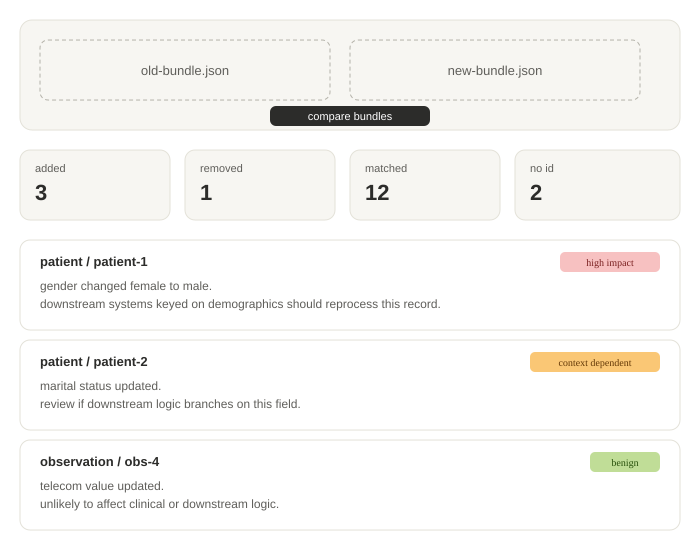

# FHIR bundle diff & explainer

🚧 Work in progress — portfolio project

Compares two versions of a patient's medical record (FHIR format) and uses AI to flag which changes actually matter — and which are just noise.



Built as a hands-on project to apply a healthcare interoperability background (FHIR, HL7) to AI-assisted software engineering. This doc also serves as the running reference for setup decisions.

## What it does

Compares two FHIR bundles structurally, then uses an LLM to generate a plain-language explanation of clinically significant changes — aimed at the developers and QA testers who'd consume this as a library, not at clinicians directly.

## How it works

1. **Diff engine** (`FhirDiff.Core`, no AI) — matches resources between the old and new bundle by type and id, then does a full field-level comparison, recursing into nested objects and arrays.
2. **Explanation layer** (`FhirDiff.Ai`) — takes only the matched-but-changed resources and asks Gemini to explain their real-world significance, guided by domain hints (e.g. a changed patient gender is high-impact, a changed phone number is not). Added/removed/unidentifiable resources get a fixed local message instead of an API call, to save request budget.
3. **Web viewer** (`FhirDiff.Web`) — renders the diff and explanations, color-coded by significance.

Key design principle: the diff engine is deterministic and AI-agnostic. `IDiffExplainer` is a swappable interface — Gemini today, could be a different backend later — which also keeps unit tests free of live API calls.

## Tech stack

- **Language/runtime**: C#, .NET (latest LTS)
- **FHIR parsing**: Firely .NET SDK (`Hl7.Fhir.R4`) — industry-standard, MIT licensed
- **FHIR version**: R4 — still dominant in production EHR systems; R5 adoption is thin
- **AI/explanation**: Google Gemini API, free tier (rate-limited by requests/day, not token-billed)
- **API**: ASP.NET Core Web API — exposes a `/compare` endpoint
- **UI**: Blazor WebAssembly — static hosting on GitHub Pages
- **Test data**: Synthea (synthetic patient records) — never real or de-identified patient data
- **Testing**: xUnit; `IDiffExplainer` is mockable, keeping CI free and fast
- **IDE**: Visual Studio Community

Built at zero budget: free-tier services only, no paid infrastructure, not GitHub Student Pack eligible.

## Repository structure

```
FhirBundleDiff/
├── src/
│   ├── FhirDiff.Core/       # R4 parsing, structural diff (no AI)
│   ├── FhirDiff.Ai/         # IDiffExplainer interface + Gemini implementation
│   ├── FhirDiff.Api/        # ASP.NET Core Web API
│   └── FhirDiff.Web/        # Blazor WASM UI
├── tests/
│   ├── FhirDiff.Core.Tests/
│   └── FhirDiff.Ai.Tests/
├── docs/
│   ├── PROGRESS-LOG.md      # session-by-session build log
│   └── screenshots/
└── .github/workflows/       # CI: build + unit tests
```

## Data flow

1. Upload/paste two FHIR R4 bundles (JSON).
2. `FhirDiff.Core` produces a structural diff: added, removed, and modified resources, down to field level.
3. Only clinically ambiguous changes are sent to Gemini, as a compact structured summary — not raw FHIR JSON.
4. `IDiffExplainer` (Gemini) returns a structured explanation per change: resource, id, plain-language significance.
5. The API returns combined JSON; the Blazor UI renders a diff table plus an explanation panel, color-coded by significance.

## Project status

- [x] Bundle matching (added/removed/matched-by-key classification)
- [x] Field-level diff engine, including nested object and array handling
- [x] Noise-field filtering (ignores irrelevant metadata like save timestamps)
- [x] Gemini API research and prompt strategy
- [ ] `GeminiDiffExplainer` HTTP implementation
- [ ] Error and rate-limit handling
- [ ] Web API `/compare` endpoint
- [ ] Blazor UI
- [ ] Sample bundles (Synthea) + demo screenshot/GIF
- [ ] GitHub Actions CI
- [ ] Deploy to GitHub Pages

## Running it locally

```bash
git clone https://github.com/<your-username>/<repo-name>.git
cd <repo-name>
dotnet build
dotnet test
```

A Gemini API key (free, from [Google AI Studio](https://aistudio.google.com/api-keys)) is required for the AI explanation layer. Set it via `appsettings.Local.json` (gitignored).

## Open items / future milestones

- Possible ML classifier module (clinically significant vs. administrative change) using scikit-learn or ML.NET — deferred, would need labeled sample data.
- Possible R5 support as a later milestone.
- Possible offline/no-quota fallback as a second `IDiffExplainer` implementation.

## Background

This project combines a healthcare interoperability background (FHIR, HL7) with AI/ML engineering practice. Design decisions, debugging process, and lessons learned are logged session-by-session in [`docs/PROGRESS-LOG.md`](docs/PROGRESS-LOG.md).